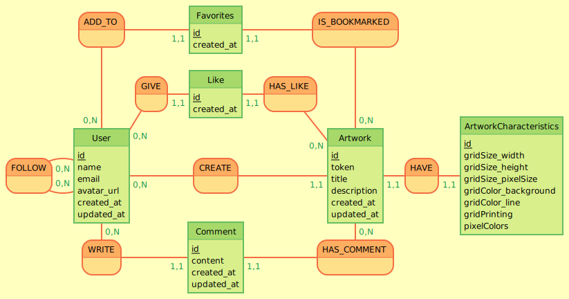

# Dictionnaire des données - PixelArtAvenue

## Table "user"

| Nom du champ  | Type           | Contraintes              | Description |
| :------------ |:---------------| :------------------------|:--------------- |
| id            | int            | PRIMARY KEY              | Identifiant unique de l'utilisateur |
| name          | VARCHAR(255)   | NOT NULL UNIQUE          | Nom de l'utilisateur, doit être unique |
| email         | VARCHAR(255)   | NOT NULL UNIQUE          | Adresse email unique de l'utilisateur |
| password      | VARCHAR(255)   |                          | Mot de passe de l'utilisateur, optionnel (pour les inscriptions sans Google) |
| avatar_url    | VARCHAR(255)   |                          | URL de l'avatar de l'utilisateur |
| created_at    | TIMESTAMP      | NOT NULL DEFAULT now()   | Date/heure de création |
| updated_at    | TIMESTAMP      |                          | Date/heure de la dernière mise à jour |

## Table "artwork"

| Nom du champ  | Type           | Contraintes              | Description |
| :------------ |:---------------| :------------------------|:--------------- |
| id            | int            | PRIMARY KEY              | Identifiant unique de l'œuvre |
| token         | VARCHAR(255)   | NOT NULL UNIQUE          | Token unique de l'œuvre |
| title         | VARCHAR(255)   | NOT NULL                 | Titre de l'œuvre |
| description   | TEXT           |                          | Description de l'œuvre |
| user_id       | int            | FOREIGN KEY (ON DELETE SET NULL) | Référence à l'utilisateur créateur, laissé à NULL si supprimé |
| created_at    | TIMESTAMP      | NOT NULL DEFAULT now()   | Date/heure de création |
| updated_at    | TIMESTAMP      |                          | Date/heure de la dernière mise à jour |

## Table "artwork_characteristics"

| Nom du champ       | Type           | Contraintes              | Description |
| :----------------- |:---------------| :------------------------|:--------------- |
| id                 | int            | PRIMARY KEY              | Identifiant unique des caractéristiques |
| artwork_id         | int            | FOREIGN KEY (ON DELETE CASCADE) | Référence à l'œuvre |
| gridSize_width     | int            | NOT NULL                 | Largeur de la grille en nombre de cellules |
| gridSize_height    | int            | NOT NULL                 | Hauteur de la grille en nombre de cellules |
| gridSize_pixelSize | int            | NOT NULL                 | Taille des pixels de la grille |
| gridColor_background | VARCHAR(255) | NOT NULL                 | Couleur de fond de la grille |
| gridColor_line     | VARCHAR(255)   | NOT NULL                 | Couleur des lignes de la grille |
| gridPrinting       | VARCHAR(255)   | NOT NULL                 | Type d'impression de la grille |
| pixelColors        | JSONB          | NOT NULL                 | Couleurs des pixels sous forme de JSONB |

## Table "comment"

| Nom du champ  | Type           | Contraintes              | Description |
| :------------ |:---------------| :------------------------|:--------------- |
| id            | int            | PRIMARY KEY              | Identifiant unique du commentaire |
| user_id       | int            | FOREIGN KEY (ON DELETE SET NULL) | Référence à l'utilisateur auteur, laissé à NULL si supprimé |
| artwork_id    | int            | FOREIGN KEY (ON DELETE CASCADE) | Référence à l'œuvre associée |
| content       | TEXT           | NOT NULL                 | Contenu du commentaire |
| created_at    | TIMESTAMP      | NOT NULL DEFAULT now()   | Date/heure de création |
| updated_at    | TIMESTAMP      |                          | Date/heure de la dernière mise à jour |

## Table "like"

| Nom du champ  | Type           | Contraintes              | Description |
| :------------ |:---------------| :------------------------|:--------------- |
| id            | int            | PRIMARY KEY              | Identifiant unique du like |
| user_id       | int            | FOREIGN KEY (ON DELETE CASCADE) | Référence à l'utilisateur ayant aimé |
| artwork_id    | int            | FOREIGN KEY (ON DELETE CASCADE) | Référence à l'œuvre aimée |
| created_at    | TIMESTAMP      | NOT NULL DEFAULT now()   | Date/heure du like |

## Table "favorites"

| Nom du champ  | Type           | Contraintes              | Description |
| :------------ |:---------------| :------------------------|:--------------- |
| id            | int            | PRIMARY KEY              | Identifiant unique du favori |
| user_id       | int            | FOREIGN KEY (ON DELETE CASCADE) | Référence à l'utilisateur |
| artwork_id    | int            | FOREIGN KEY (ON DELETE CASCADE) | Référence à l'œuvre mise en favori |
| created_at    | TIMESTAMP      | NOT NULL DEFAULT now()   | Date/heure du favori |

## Table "follow"

| Nom du champ  | Type           | Contraintes              | Description |
| :------------ |:---------------| :------------------------|:--------------- |
| follower_id   | int            | FOREIGN KEY (ON DELETE CASCADE) | Référence à l'utilisateur suiveur |
| followed_id   | int            | FOREIGN KEY (ON DELETE CASCADE) | Référence à l'utilisateur suivi |
| created_at    | TIMESTAMP      | NOT NULL DEFAULT now()   | Date/heure de début du suivi |
| PRIMARY KEY   | (follower_id, followed_id) |              | Combinaison unique pour représenter une relation de suivi |

---

### Représentation du MCD

Ci-dessous se trouve une représentation du Modèle Conceptuel de Données (MCD) de la base de données, illustrant les relations entre les entités :

  
*Réalisé avec [Mocodo](https://www.mocodo.net/)*

---
